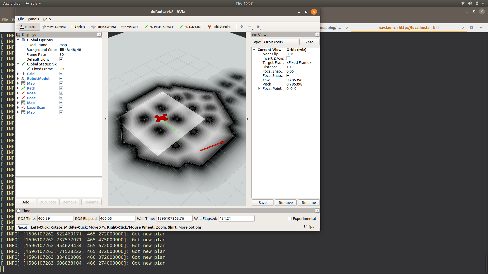
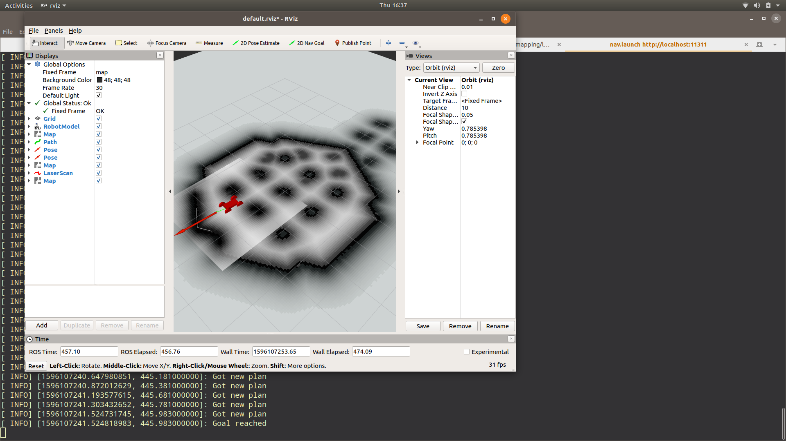

# Rover Navigation

### Usage 

1. Go to the launch folder
2. Launch all the simulation files
```bash
roslaunch sim.launch
```

3. Launch the depth to laser scanner
```bash
bash depth_laser.sh
```
4. Launch the map_server
```bash
bash run.sh
```
5. Launch the entire nav stack
```bash
roslaunch nav.launch
```
### Output



